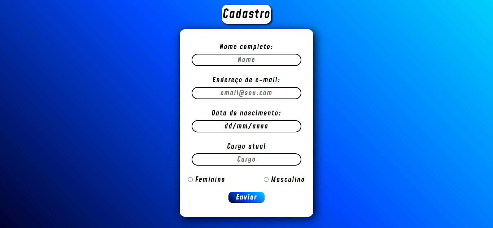

# *__Cadastro__*

    
    

 

>Formúlario para cadasatro simples, com comclução em um identificador.

## **_Tecnologias_**

    
    
    

#

Pratico de cadstrar e de facil preenchimento

    

#

## **_Uso no mobile_**

Compatibilidade com aparelhos moveis, como smartphones e tablets

    
    

#
## **_Desktop_**

>Simples e bonito 😝❤️

    

#
## **_Licença_**
>MIT License &#169; zandrocr
